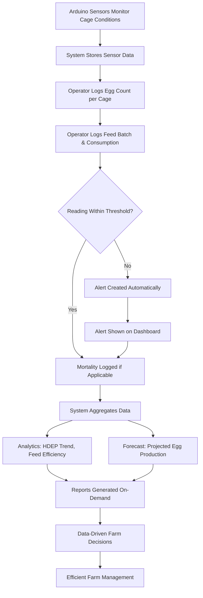

# LayRate Proposed System Workflow (To-Be Process)

This shows how the LayRate system replaces each manual/problem step from the
current (As-Is) farm process with a digital, automated equivalent.

---

## As-Is → To-Be Mapping

| # | As-Is (Manual Process) | To-Be (LayRate System) |
|---|---|---|
| 1 | Farmer manually observes hens | Arduino sensors continuously monitor each cage's temperature & humidity, feeding live data to the system |
| 2 | Manually counts egg production | Operator enters exact egg count per cage in **Egg Logging** — stored digitally, no miscounts |
| 3 | No per-cage or row monitoring | **Cage Management** tracks each cage individually (CAGE-A, B, C, D) with its own logs, stats, and alerts |
| 4 | Measures total feed given (60kg per flock, lump sum) | **Feed & Nutrition** logs exact kg consumed per cage per day, tied to a specific feed batch |
| 5 | Uses standard feed with known protein content (untracked) | Feed batches store crude protein % digitally — traceable per batch, per cage |
| 6 | Occasionally checks temperature and humidity | **Environment Monitor** shows live sensor readings continuously, not occasionally |
| 7 | No systematic data recording or storage | All readings, logs, and counts are stored in a structured MySQL database |
| 8 | No data analysis or forecasting | **Analytics** (HDEP trend, feed vs. production) and **Forecast** (projected egg production) modules |
| 9 | Relies on experience for decision making | Dashboard metrics, reports, and analytics give data-backed decisions, not just gut feel |
| 10 | No alerts or real-time monitoring | System auto-generates an **Alert** the moment temperature/humidity crosses a threshold |
| 11 | Late detection of production issues | Alerts appear instantly on the **Dashboard** — issues are caught the moment they happen |
| 12 | Limited insights on farm performance | **Reports** module generates full production/feed/environment/mortality reports, printable and exportable |
| 13 | Inefficient farm management | Centralized, data-driven farm management — decisions backed by real numbers |

---

## Step-by-Step Process Flow (To-Be)

```
1. Arduino Sensors Monitor Cage Conditions
   → Continuously reads temperature & humidity per cage
        │
        ▼
2. Raspberry Pi / LayRate System Receives Sensor Data
   → Stored automatically in the Environmental Logs table
        │
        ▼
3. Operator Logs Daily Egg Count (per Cage)
   → Egg Logging module computes HDEP automatically
        │
        ▼
4. Operator Logs Feed Batch & Consumption (per Cage)
   → Feed & Nutrition module tracks kg consumed + protein %
        │
        ▼
5. System Checks Readings Against Configured Thresholds
   → If temp/humidity is out of range → Alert is created
        │
        ▼
6. Alert Appears on Dashboard (Real-Time)
   → Operator/Admin sees it immediately, marks as read once addressed
        │
        ▼
7. Mortality Logged (if applicable)
   → Cage, date, count, reason recorded in Mortality Log
        │
        ▼
8. System Aggregates Data Over Time
   → Analytics module shows HDEP trend, feed efficiency, mortality patterns
        │
        ▼
9. Forecast Module Projects Future Production
   → Based on historical production data
        │
        ▼
10. Reports Generated On-Demand
    → Production / Feed / Environment / Mortality — printable, exportable to CSV
        │
        ▼
11. Farm Manager Makes Data-Driven Decisions
    → Adjust feed, address alerts, plan ahead using forecast & reports
        │
        ▼
12. Efficient, Transparent Farm Management
```

---

## Mermaid Flowchart (for manuscript diagrams)



You can paste the Mermaid block into any Mermaid renderer (e.g. mermaid.live) to export it as an image for your manuscript.
